# Wood Pellets Price
This page provides a visual representation of wood pellet price trends in Switzerland. All prices are displayed in CHF.

## Price Graphs

### Long-Term Price Trends
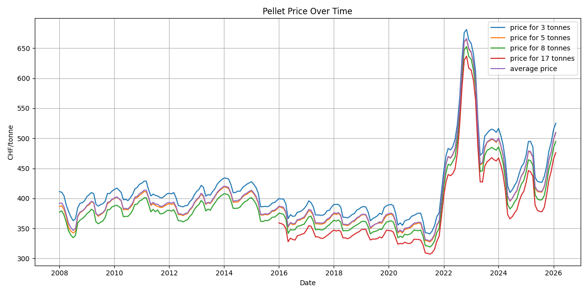

### Yearly Price Breakdown
The following graphs provide a yearly breakdown of wood pellet prices to observe annual variations:

#### 2025
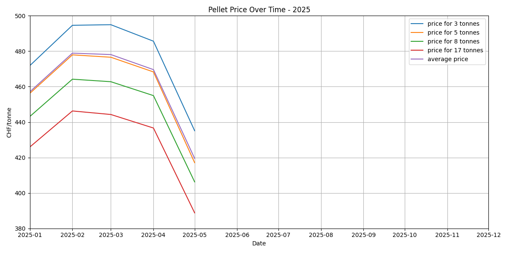
#### 2024
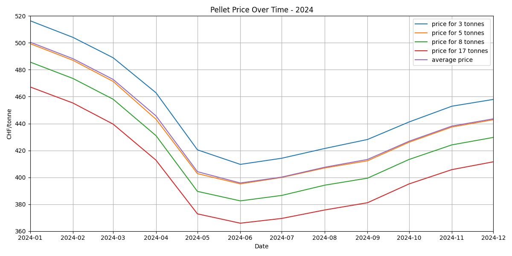
#### 2023
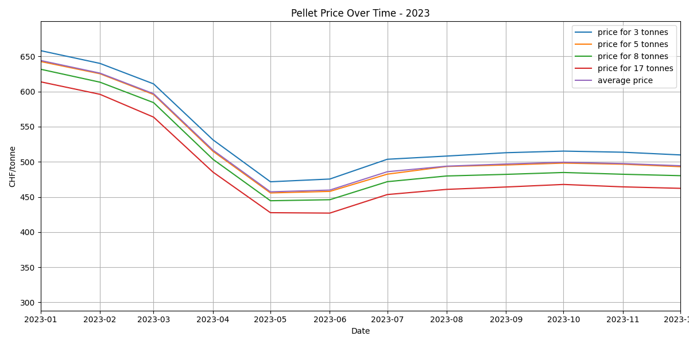
#### 2022
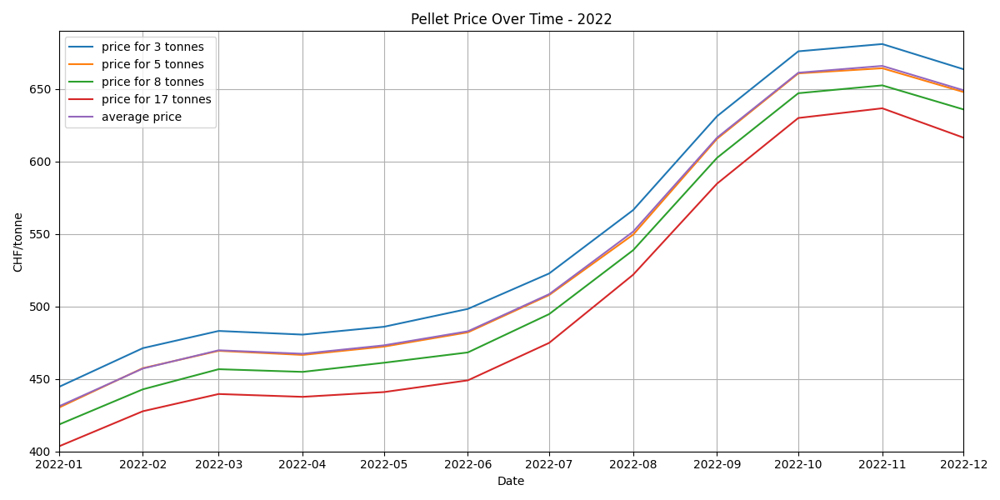
#### 2021
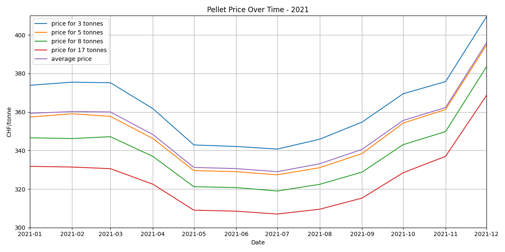
#### 2020
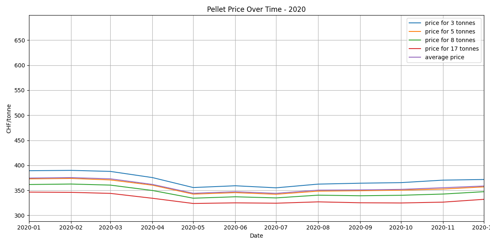
#### 2019

#### 2018
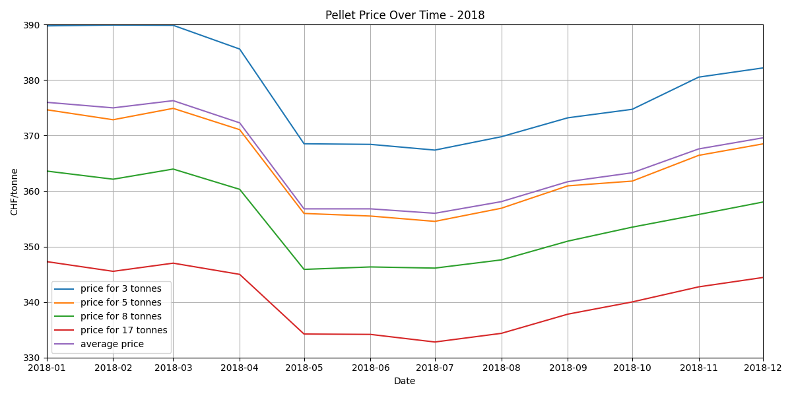
#### 2017
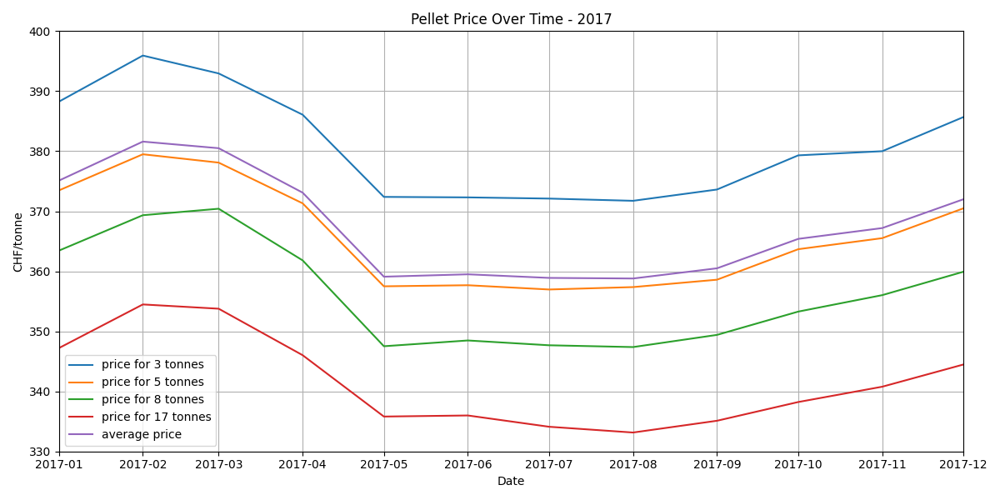
#### 2016
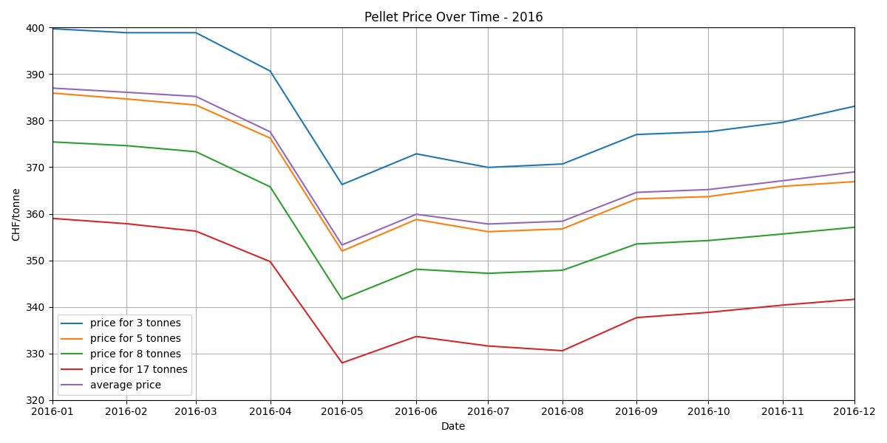
#### 2015
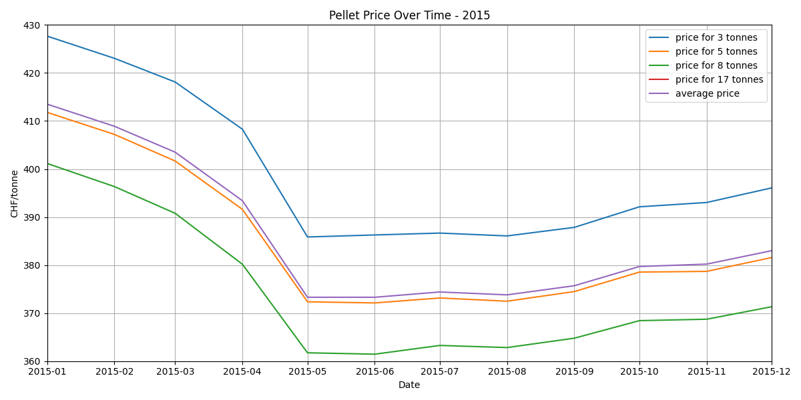
#### 2014
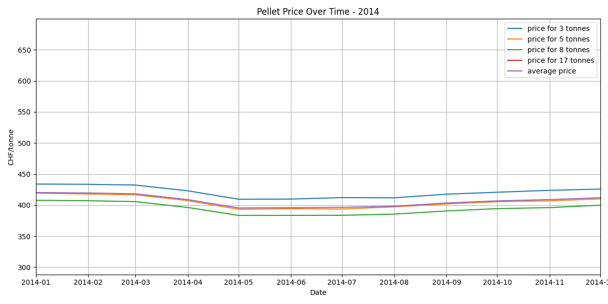
#### 2013
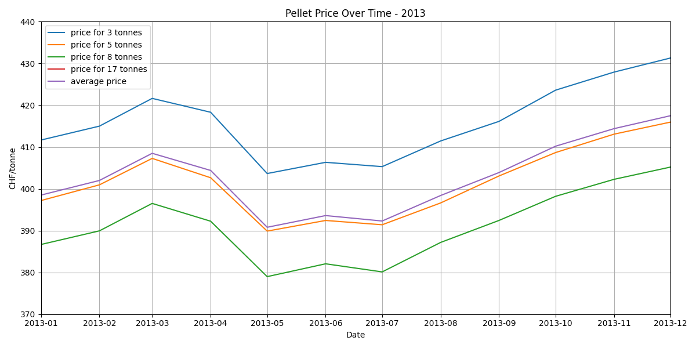
#### 2012
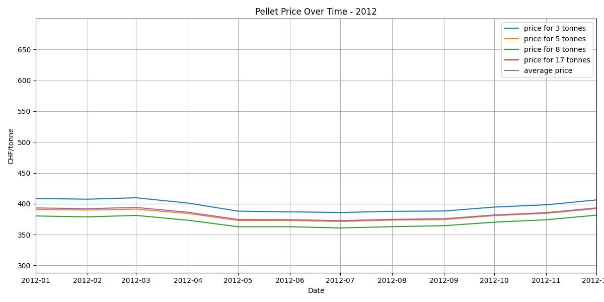
#### 2011
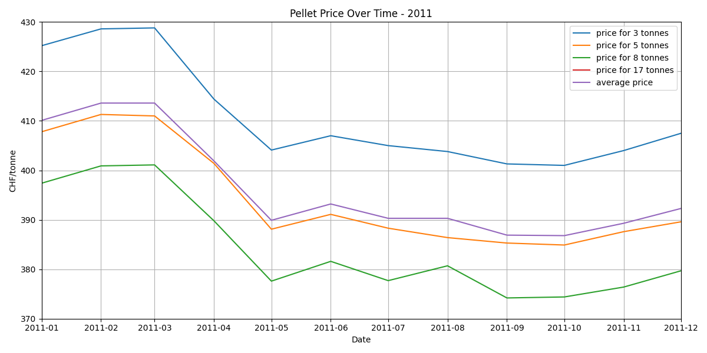
#### 2010
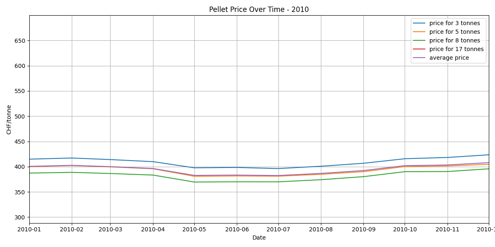
#### 2009
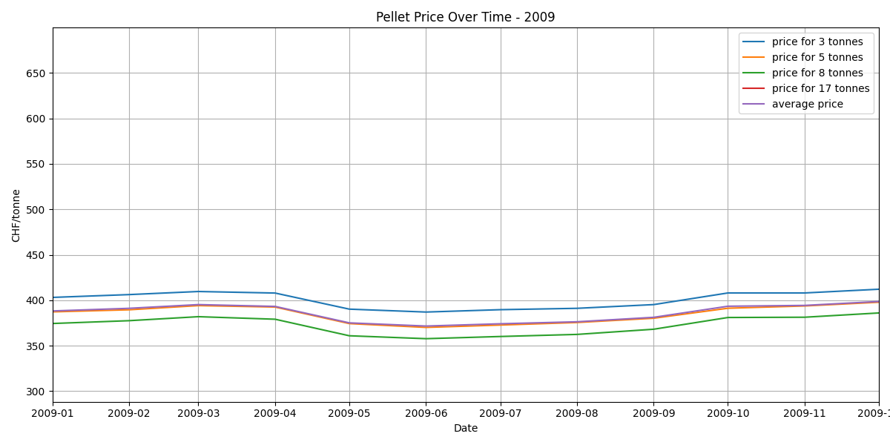
#### 2008
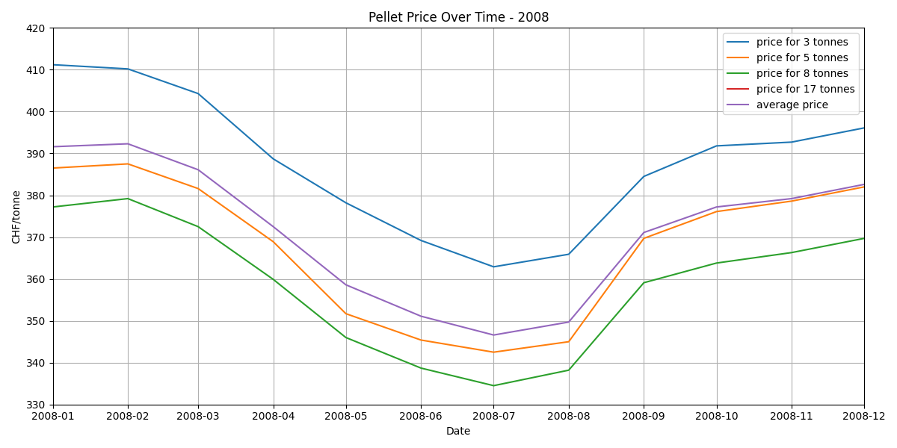
